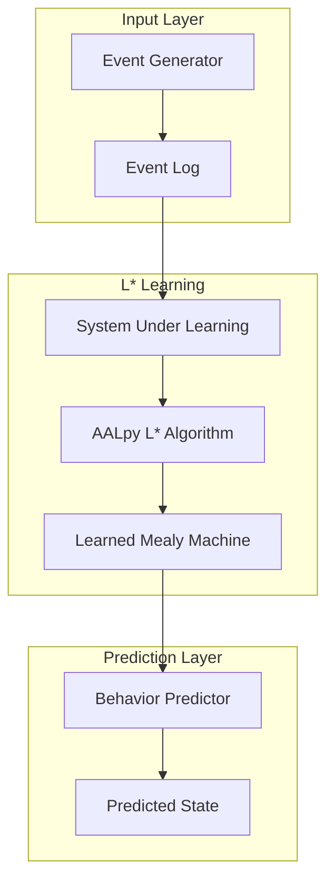
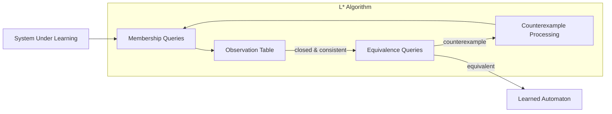

# L* Automata Learning Module

## Overview

This module implements L* automata learning for agent behavior prediction. It learns patterns from event logs and uses them to predict agent states during reconstruction.

## What's in This Directory

- **`sul.py`** - System Under Learning (SUL) adapter for agent events
- **`learner.py`** - L* algorithm wrapper using AALpy
- **`predictor.py`** - Behavior prediction using learned automata
- **`event_generator.py`** - Synthetic event generation for training

## Why This Code Exists

Traditional state reconstruction relies on LLM inference, which can be slow and unpredictable. L* automata learning provides:

1. **Deterministic predictions** - Same input always produces same output
2. **Fast execution** - O(n) prediction vs. LLM API calls
3. **Explainable behavior** - Automaton structure is inspectable

**Thesis Contribution**: This module provides a novel hybrid reconstruction approach combining:
- L* learned patterns for structured workflows
- LLM inference for unstructured scenarios

## Key Components

### System Under Learning (SUL)

Adapts agent event logs for automata learning:

```python
from src.automata.sul import create_sul_from_events, AgentBehaviorSUL

# Create SUL from events
events = query_agent_events("product-agent-1")
sul = create_sul_from_events(events)

# Query the SUL
inputs = ["TASK_ASSIGN", "validate_product_data"]
outputs = sul.query(inputs)
print(f"Outputs: {outputs}")
```

### Automata Learner

Learns Mealy machines from event data:

```python
from src.automata.learner import AutomataLearner, learn_agent_behavior

# Learn automaton
learner = AutomataLearner(model_type="mealy")
result = learner.learn(events)

print(f"Learned {result.num_states} states")
print(f"With {result.num_transitions} transitions")
print(f"Learning took {result.learning_time_ms:.2f}ms")

# Predict next output
prediction = learner.predict_next_output(
    ["TASK_ASSIGN", "validate_product_data", "generate_listing"]
)
print(f"Predicted next: {prediction}")
```

### Behavior Predictor

High-level predictor for state reconstruction:

```python
from src.automata.predictor import BehaviorPredictor

predictor = BehaviorPredictor()
predictor.train(events)

# Predict next action
prediction = predictor.predict_next_action(
    recent_actions=["validate_product_data", "generate_listing"],
    current_status="in_progress"
)

print(f"Predicted action: {prediction.predicted_action}")
print(f"Confidence: {prediction.confidence.value}")
print(f"Confidence score: {prediction.confidence_score}")
```

### Event Generator

Generate synthetic events for training:

```python
from src.automata.event_generator import generate_training_events, SyntheticEventGenerator

# Quick generation
events = generate_training_events(num_events=100)

# Custom generation
generator = SyntheticEventGenerator(
    failure_probability=0.2,
    recovery_probability=0.9,
    random_seed=42,
)

events = generator.generate_training_dataset(
    num_workflows=50,
    num_handoffs=20,
    num_context_requests=15,
)
```

## Usage Examples

### Complete Automata Learning Flow

```python
from src.automata.learner import AutomataLearner
from src.automata.predictor import BehaviorPredictor
from src.automata.event_generator import generate_training_events

# Generate training data
training_events = generate_training_events(num_events=200, random_seed=42)

# Train predictor
predictor = BehaviorPredictor()
result = predictor.train(training_events)

print(f"Training successful: {result.success}")
print(f"Model accuracy estimate: {predictor.model_accuracy:.2%}")

# Use for state reconstruction
reconstructed_state = predictor.predict_state_for_reconstruction(
    agent_id="product-agent-1",
    last_checkpoint_state={"status": "in_progress", "current_step": 1},
    events_since_checkpoint=[
        {"action_type": "validate_product_data"},
        {"action_type": "generate_listing"},
    ]
)

print(f"Reconstructed state: {reconstructed_state}")
```

### Using with Chaos Framework

```python
from src.chaos.runner import ChaosRunner, RunnerConfig
from src.automata.learner import AutomataLearner
from src.persistence.event_store import EventStore

# Run chaos scenarios to generate events
config = RunnerConfig(
    runs_per_scenario=50,
    scenarios=["ProductCrashMidUpload", "MarketingTimeout"],
)
runner = ChaosRunner(config)
runner.run_all()

# Load events from event store
event_store = EventStore()
events = event_store.get_all_events()

# Train automaton on real chaos data
learner = AutomataLearner()
result = learner.learn(events)

print(f"Learned from {len(events)} real events")
```

## Architecture



## L* Algorithm Overview

The L* algorithm learns a minimal deterministic finite automaton (DFA) or Mealy machine from a System Under Learning (SUL):



**Key Properties:**
- **Minimal**: Learns the smallest automaton consistent with observations
- **Exact**: Provably correct if SUL is deterministic
- **Efficient**: Polynomial in automaton size

## Input/Output Alphabets

| Input Alphabet | Output Alphabet |
|----------------|-----------------|
| `TASK_ASSIGN` | `pending` |
| `TASK_COMPLETE` | `in_progress` |
| `REQUEST_CONTEXT` | `completed` |
| `PROVIDE_CONTEXT` | `failed` |
| `validate_product_data` | `validated` |
| `generate_listing` | `generated` |
| `confirm_upload` | `confirmed` |
| `handoff` | `handoff_complete` |
| `failure` | `error` |

## Configuration

### Learner Settings

| Parameter | Default | Description |
|-----------|---------|-------------|
| `model_type` | `"mealy"` | Automaton type (mealy, moore, dfa) |
| `random_walk_steps` | `5000` | Steps for equivalence oracle |
| `max_learning_rounds` | `100` | Maximum learning iterations |

### Predictor Settings

| Parameter | Default | Description |
|-----------|---------|-------------|
| `min_confidence_threshold` | `0.5` | Minimum confidence for predictions |

## Dependencies

```toml
[tool.poetry.dependencies]
aalpy = "^1.4"
```

## Testing

Run automata module tests:

```bash
pytest tests/test_automata.py -v
```

## Related Modules

- **[`src/reconstruction/hybrid.py`](../reconstruction/hybrid.py)** - Uses automata for hybrid reconstruction
- **[`src/reconstruction/automata_reconstructor.py`](../reconstruction/automata_reconstructor.py)** - Automata-only reconstruction
- **[`src/chaos/`](../chaos/README.md)** - Generates events for training
- **[`src/persistence/event_store.py`](../persistence/event_store.py)** - Stores events for learning

## Success Criteria

| Metric | Target |
|--------|--------|
| Learning from event log | 100+ events |
| Next action prediction | >70% accuracy |
| Prediction time | <10ms |

