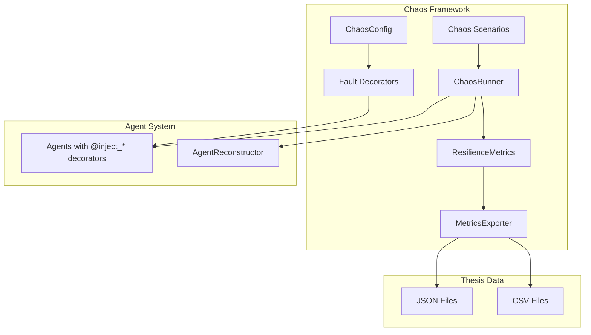

# Chaos Engineering Module

## Overview

This module provides a Python-based chaos engineering framework for testing agent resilience, measuring MTTR-A (Mean Time to Recovery - Agentic), and generating thesis evaluation data.

## What's in This Directory

- **`exceptions.py`** - Custom exception types for chaos faults
- **`config.py`** - Chaos configuration via environment variables
- **`decorators.py`** - 5 fault injection decorators
- **`scenarios.py`** - 5 chaos scenario definitions
- **`runner.py`** - Scenario runner for batch execution
- **`metrics.py`** - ResilienceMetrics class for MTTR-A measurement
- **`export.py`** - JSON/CSV export utilities for thesis data

## Why This Code Exists

The chaos engineering framework addresses critical thesis requirements:

- **Systematic Resilience Testing**: Test agent recovery capabilities under controlled failures
- **MTTR-A Measurement**: Measure Mean Time to Recovery for agentic systems
- **Thesis Evaluation Data**: Generate quantitative data for thesis evaluation chapter
- **Reproducible Experiments**: Run repeatable chaos scenarios for statistical analysis

## Key Components

### Fault Injection Decorators

5 decorators for injecting different fault types:

```python
from src.chaos.decorators import (
    inject_crash,
    inject_delay,
    inject_timeout,
    inject_hallucination,
    inject_message_corruption,
)

# Crash injection - raises AgentCrashException
@inject_crash(probability=0.2)
def agent_step(state):
    return process(state)

# Delay injection - adds latency
@inject_delay(delay_ms=500, probability=0.3)
def slow_operation(data):
    return compute(data)

# Timeout injection - simulates unresponsive agent
@inject_timeout(timeout_seconds=30, probability=0.1)
def may_timeout(state):
    return handle(state)

# LLM hallucination - returns wrong output
@inject_hallucination(probability=0.15)
def llm_call(prompt):
    return llm.invoke(prompt)

# Message corruption - corrupts protocol messages
@inject_message_corruption(probability=0.1, fields=["payload"])
def send_message(msg):
    return transmit(msg)
```

### Convenience Decorator

Apply multiple faults at once:

```python
from src.chaos.decorators import with_chaos

@with_chaos(crash_prob=0.1, delay_prob=0.2, delay_ms=500)
def risky_operation(data):
    return process(data)
```

### Configuration

Configure via environment variables or programmatically:

```bash
# Environment variables
export CHAOS_ENABLED=true
export CHAOS_CRASH_PROBABILITY=0.2
export CHAOS_DELAY_MS=500
export CHAOS_TIMEOUT_SECONDS=30
```

```python
from src.chaos.config import (
    get_chaos_config,
    enable_chaos,
    disable_chaos,
)

# Enable/disable chaos globally
enable_chaos()
disable_chaos()

# Access config
config = get_chaos_config()
print(config.crash_probability)
```

### Chaos Scenarios

5 pre-defined e-commerce scenarios:

| Scenario | Description |
|----------|-------------|
| `ProductCrashMidUpload` | Product agent crashes at 50% progress |
| `MarketingTimeout` | Marketing agent times out after handoff |
| `HandoffCorruption` | Protocol message corrupted in transit |
| `DelayedRecovery` | Agent responds slowly, tests false positive handling |
| `CascadeFailure` | Multiple agents crash sequentially |

```python
from src.chaos.scenarios import get_scenario, list_scenarios

# List available scenarios
print(list_scenarios())  # ['ProductCrashMidUpload', ...]

# Run a scenario
scenario = get_scenario("HandoffCorruption")
result = scenario.run()
print(f"Success: {result.success}, MTTR: {result.mttr_seconds}s")
```

### Scenario Runner

Run multiple scenarios with statistics:

```python
from src.chaos.runner import ChaosRunner, RunnerConfig

config = RunnerConfig(
    runs_per_scenario=10,
    delay_between_runs=1.0,
    scenarios=["HandoffCorruption", "DelayedRecovery"],
)

runner = ChaosRunner(config)
summary = runner.run_all()

print(f"Success rate: {summary.success_rate}%")
print(f"Recovery rate: {summary.recovery_rate}%")
print(f"Average MTTR: {summary.average_mttr_seconds}s")
```

### Resilience Metrics

Collect and analyze MTTR-A and other metrics:

```python
from src.chaos.metrics import get_metrics, ResilienceMetrics

metrics = get_metrics()
metrics.start_measurement()

# Record failures and recoveries
with metrics.measure_recovery("agent-1", "thread-1", "crash") as event:
    # Perform recovery
    result = reconstructor.reconstruct(agent_id, thread_id)
    event.reconstruction_accuracy = 0.95

# Get summary statistics
summary = metrics.get_summary()
print(f"MTTR Average: {summary.mttr_avg}s")
print(f"MTTR P95: {summary.mttr_p95}s")
print(f"Recovery Success Rate: {summary.recovery_success_rate}%")
```

### Export to JSON/CSV

Export metrics for thesis analysis:

```python
from src.chaos.export import MetricsExporter, quick_export

# Quick export
files = quick_export(metrics, output_dir="data/metrics")

# Or use exporter directly
exporter = MetricsExporter(output_dir="data/metrics")
exporter.export_all(metrics)
```

**Output Files:**
- `chaos_full_metrics_TIMESTAMP.json` - All metrics data
- `chaos_summary_TIMESTAMP.json` - Summary statistics
- `chaos_events_TIMESTAMP.csv` - Recovery events
- `chaos_mttr_TIMESTAMP.csv` - MTTR data for analysis

## Usage Examples

### Complete Chaos Testing Workflow

```python
from src.chaos.config import enable_chaos
from src.chaos.runner import ChaosRunner, RunnerConfig
from src.chaos.metrics import get_metrics
from src.chaos.export import MetricsExporter
from src.workflows.product_workflow import create_product_upload_workflow

# Setup
enable_chaos()
metrics = get_metrics()
metrics.start_measurement()

# Configure and run
config = RunnerConfig(
    runs_per_scenario=100,
    scenarios=["ProductCrashMidUpload", "MarketingTimeout"],
    workflow_factory=create_product_upload_workflow,
    initial_state={...},
)

runner = ChaosRunner(config)
summary = runner.run_all()

# Record and export
for result in summary.results:
    metrics.record_scenario_result(result)

exporter = MetricsExporter(output_dir="data/thesis")
exporter.export_all(metrics)

# Print summary
print(f"Total runs: {summary.total_runs}")
print(f"Success rate: {summary.success_rate:.1f}%")
print(f"Average MTTR: {summary.average_mttr_seconds:.2f}s")
```

### Quick Chaos Test

```python
from src.chaos.runner import run_quick_chaos_test

summary = run_quick_chaos_test(
    scenarios=["HandoffCorruption", "DelayedRecovery"],
    runs_per_scenario=5,
)
print(f"Success rate: {summary.success_rate}%")
```

### Testing with Decorators

```python
from src.chaos.config import enable_chaos
from src.chaos.decorators import inject_crash

enable_chaos()

@inject_crash(probability=0.2)
def my_agent_step(state):
    # Agent logic here
    return updated_state

# Run with 20% chance of crash
try:
    result = my_agent_step(state)
except AgentCrashException:
    # Handle crash, trigger recovery
    pass
```

## Architecture



## Metrics Collected

| Metric | Description | Unit |
|--------|-------------|------|
| MTTR-A | Mean Time to Recovery - Agentic | seconds |
| MTTR P50/P95/P99 | MTTR percentiles | seconds |
| Recovery Success Rate | % of failures that recover | % |
| Reconstruction Accuracy | Correctness of reconstructed state | 0.0-1.0 |
| Task Completion Rate | % of workflows that complete | % |
| Peer Context Usage Rate | % of recoveries using peer context | % |

## Configuration Reference

| Environment Variable | Default | Description |
|---------------------|---------|-------------|
| `CHAOS_ENABLED` | `false` | Enable/disable chaos globally |
| `CHAOS_CRASH_PROBABILITY` | `0.1` | Probability of crash injection |
| `CHAOS_DELAY_MS` | `500` | Delay duration in milliseconds |
| `CHAOS_DELAY_PROBABILITY` | `0.2` | Probability of delay injection |
| `CHAOS_TIMEOUT_SECONDS` | `30` | Timeout duration in seconds |
| `CHAOS_TIMEOUT_PROBABILITY` | `0.1` | Probability of timeout injection |
| `CHAOS_HALLUCINATION_PROBABILITY` | `0.1` | Probability of LLM hallucination |
| `CHAOS_CORRUPTION_PROBABILITY` | `0.1` | Probability of message corruption |
| `CHAOS_RANDOM_SEED` | None | Seed for reproducibility |

## Testing

Run chaos framework tests:

```bash
pytest tests/test_chaos.py -v
```

## Related Modules

- **[`src/reconstruction/`](../reconstruction/README.md)** - Recovery uses reconstruction module
- **[`src/protocol/`](../protocol/README.md)** - HandoffCorruption scenario tests protocol validation
- **[`src/messaging/`](../messaging/README.md)** - Peer context metrics track Kafka usage
- **[`src/workflows/`](../workflows/README.md)** - Scenarios test workflow resilience

