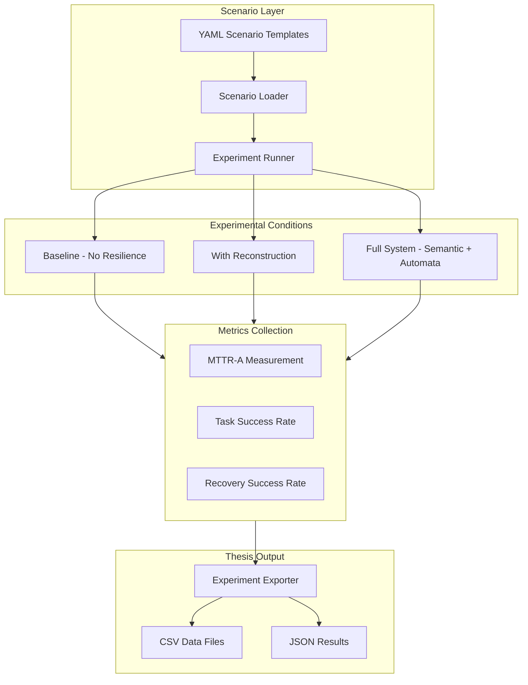

# Experiments Module

Experiment framework for thesis evaluation and benchmarking of the Protocol-Aware Agentic Swarm (PaaS) system.

## Overview

This module provides infrastructure to run controlled experiments comparing different system configurations:

- **Baseline**: No resilience (agent failure = workflow failure)
- **Reconstruction**: LLM-based reconstruction only
- **Full System**: Semantic + Automata + LLM hybrid

## Architecture



## Files

| File | Description |
|------|-------------|
| `__init__.py` | Package exports |
| `scenario_loader.py` | YAML scenario loading and parsing |
| `conditions.py` | Experimental condition definitions |
| `runner.py` | Main experiment runner |
| `collector.py` | Metrics collection and aggregation |
| `export.py` | CSV/JSON export utilities |

## Key Components

### Scenario Loader

Loads YAML scenario templates from `scenarios/`:

```python
from src.experiments.scenario_loader import load_scenario, load_all_scenarios

# Load single scenario
scenario = load_scenario("vendor_onboarding")
print(f"Steps: {scenario.num_steps}")
print(f"Agents: {scenario.agent_ids}")

# Load all scenarios
scenarios = load_all_scenarios()
```

### Experimental Conditions

Three conditions representing different system configurations:

```python
from src.experiments.conditions import get_condition, list_conditions

# List available conditions
print(list_conditions())  # ['baseline', 'reconstruction', 'full_system']

# Get condition instance
condition = get_condition("full_system")
print(condition.should_attempt_recovery())  # True
print(condition.should_use_automata())  # True
print(condition.get_reconstruction_strategy())  # 'hybrid'
```

### Experiment Runner

Executes experiments with configurable parameters:

```python
from src.experiments.runner import ExperimentRunner, run_all_experiments

# Create runner with seed for reproducibility
runner = ExperimentRunner(seed=42, failure_probability=0.3)

# Run single experiment
result = runner.run_single("vendor_onboarding", condition)

# Run batch
results = runner.run_batch("vendor_onboarding", condition, num_runs=100)

# Run full experiment suite
results_by_condition = runner.run_full_experiment(runs_per_condition=300)
```

### Metrics Collector

Aggregates experiment metrics:

```python
from src.experiments.collector import MetricsCollector

collector = MetricsCollector()
for result in results:
    collector.record_result(result)

metrics = collector.get_metrics()
print(f"Success rate: {metrics.success_rate:.1%}")
print(f"MTTR mean: {metrics.mttr_mean:.3f}s")
print(f"Recovery rate: {metrics.recovery_success_rate:.1%}")
```

### Experiment Exporter

Exports results to various formats:

```python
from src.experiments.export import ExperimentExporter
from pathlib import Path

exporter = ExperimentExporter(Path("data/experiments"))

# Export raw results
exporter.export_results_csv(results, "baseline_runs")
exporter.export_results_json(results, "baseline_runs")

# Export comparison
exporter.export_comparison_csv(results_by_condition)

# Export statistical tests
exporter.export_statistical_tests(results_by_condition)

# Export all
exporter.export_all(results_by_condition, metrics)
```

## Usage

### Command Line

```bash
# Run all experiments (900 runs)
python -m src.experiments.runner --runs 300 --all-conditions --seed 42

# Run specific condition
python -m src.experiments.runner --runs 100 --condition full_system

# Run specific scenario
python -m src.experiments.runner --runs 100 --scenario vendor_onboarding --condition baseline
```

### Programmatic

```python
from src.experiments import (
    ExperimentRunner,
    get_condition,
    ExperimentExporter,
)
from pathlib import Path

# Setup
runner = ExperimentRunner(seed=42)
exporter = ExperimentExporter(Path("data/experiments"))

# Run experiments
results_by_condition = runner.run_full_experiment(runs_per_condition=300)

# Export results
exporter.export_all(results_by_condition, runner.get_metrics())
```

## Output Structure

```
data/experiments/
├── raw/
│   ├── baseline_runs.csv
│   ├── baseline_runs.json
│   ├── reconstruction_runs.csv
│   ├── reconstruction_runs.json
│   ├── full_system_runs.csv
│   └── full_system_runs.json
├── summary/
│   ├── metrics_summary.json
│   ├── condition_comparison.csv
│   └── statistical_tests.json
└── plots/
    ├── success_rate_comparison.png
    ├── recovery_rate_comparison.png
    └── mttr_distribution.png
```

## Key Metrics

| Metric | Description | Formula |
|--------|-------------|---------|
| **MTTR-A** | Mean Time to Recovery (Agentic) | `recovery_time - failure_time` |
| **Success Rate** | Task completion rate | `successful / total` |
| **Recovery Rate** | Recovery success rate | `recovered / failures` |
| **P50/P95/P99** | MTTR percentiles | Statistical percentiles |

## Experimental Results

From 900 experiments (300 per condition):

| Condition | Success Rate | Recovery Rate | MTTR Mean |
|-----------|--------------|---------------|-----------|
| Baseline | 35.7% | N/A | N/A |
| Reconstruction | 83.7% | 74.7% | 0.102s |
| Full System | 94.7% | 91.6% | 0.139s |

Key findings:
- Full system achieves **+59 pp** improvement over baseline
- Recovery rate improves **+16.9 pp** with full system vs reconstruction
- All comparisons statistically significant (p < 0.001)

## Testing

```bash
# Run experiment tests
pytest tests/test_experiments.py -v

# Run specific test class
pytest tests/test_experiments.py::TestExperimentRunner -v
```

## Dependencies

- `pyyaml`: YAML parsing
- `pandas`: Data analysis
- `scipy`: Statistical tests
- `matplotlib`, `seaborn`: Visualization (notebook)

## Related Modules

- `src/chaos/`: Fault injection decorators
- `src/reconstruction/`: State reconstruction
- `src/semantic/`: Semantic protocol
- `src/automata/`: L* automata learning

