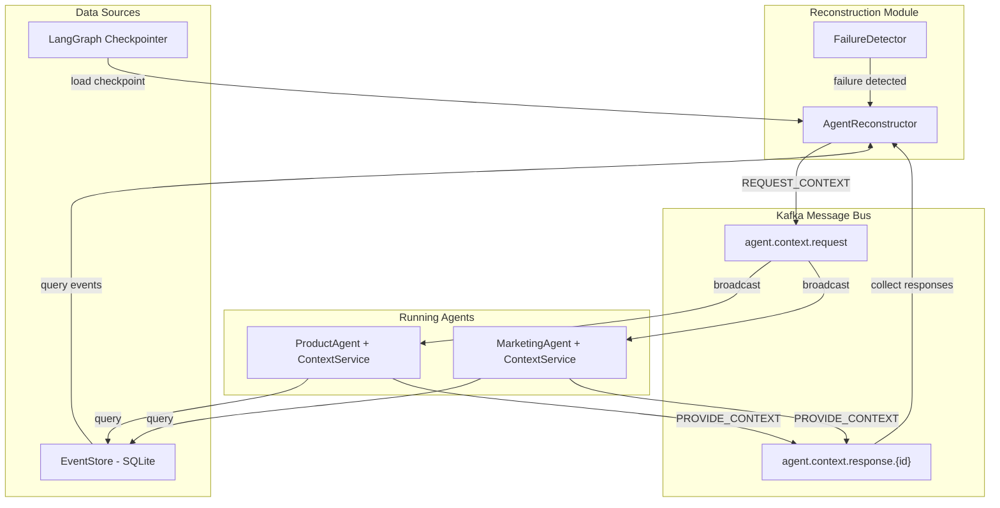

# Messaging Module

## Overview

This module provides Kafka-based messaging infrastructure for distributed inter-agent communication. It enables peer context retrieval during agent state reconstruction by allowing agents to query each other for interaction history asynchronously via Apache Kafka.

## What's in This Directory

- **`kafka_config.py`** - Kafka connection settings and topic definitions
- **`producer.py`** - Async Kafka producer for publishing messages
- **`consumer.py`** - Async Kafka consumer with message handler callbacks
- **`context_handler.py`** - Handler for querying database for agent interactions
- **`agent_context_service.py`** - Background service for handling context requests

## Why This Code Exists

The messaging module addresses critical distributed system needs:

- **Asynchronous Communication**: Agents can communicate without blocking via Kafka pub/sub
- **Peer Context Retrieval**: During reconstruction, query peer agents for their interactions with failed agents
- **Distributed Architecture**: Enables proper distributed solution where agents can respond asynchronously
- **Message Durability**: Kafka provides durable message storage and replay capability
- **Scalability**: Kafka-based architecture scales horizontally with more agents

## When It's Used

### Peer Context Retrieval (Primary Use Case)

When an agent fails and needs reconstruction:
1. Reconstruction module broadcasts `REQUEST_CONTEXT` via Kafka
2. Peer agents receive request and query their local database
3. Peer agents publish `PROVIDE_CONTEXT` responses
4. Reconstruction module collects responses within timeout window
5. Peer context enhances LLM-based state reconstruction

### Agent Context Service

Running agents use `AgentContextService` as a background service to:
- Listen for incoming `REQUEST_CONTEXT` messages
- Query event store for interactions with failed agents
- Publish `PROVIDE_CONTEXT` responses with relevant context

## Key Components

### Kafka Configuration

```python
from src.messaging.kafka_config import get_kafka_config, KafkaConfig

config = get_kafka_config()

# Access settings
print(config.bootstrap_servers)  # "localhost:9092"
print(config.context_request_topic)  # "agent.context.request"
print(config.get_response_topic("reconstructor-1"))  # "agent.context.response.reconstructor-1"
```

**Configuration via Environment Variables:**

| Variable | Default | Description |
|----------|---------|-------------|
| `KAFKA_BOOTSTRAP_SERVERS` | `localhost:9092` | Kafka broker addresses |
| `KAFKA_CONTEXT_REQUEST_TOPIC` | `agent.context.request` | Topic for context requests |
| `KAFKA_CONTEXT_RESPONSE_TOPIC_PREFIX` | `agent.context.response` | Prefix for response topics |
| `KAFKA_CONSUMER_GROUP_PREFIX` | `paas-agent` | Consumer group prefix |
| `PEER_CONTEXT_ENABLED` | `true` | Enable/disable peer context |
| `PEER_CONTEXT_TIMEOUT_SECONDS` | `5.0` | Timeout for collecting responses |

### Kafka Producer

```python
from src.messaging.producer import KafkaMessageProducer

async with KafkaMessageProducer() as producer:
    # Publish a context request
    await producer.publish_context_request(
        requester_id="reconstructor-123",
        failed_agent_id="product-agent-1",
        thread_id="thread-456",
        time_window_seconds=3600,
    )
    
    # Publish a context response
    await producer.publish_context_response(
        response_topic="agent.context.response.reconstructor-123",
        responder_id="marketing-agent-1",
        failed_agent_id="product-agent-1",
        thread_id="thread-456",
        interactions=[...],
        memory_state={...},
    )
```

### Kafka Consumer

```python
from src.messaging.consumer import KafkaMessageConsumer

async def handle_context_request(message):
    print(f"Received request for {message['failed_agent_id']}")

consumer = KafkaMessageConsumer(
    topics=["agent.context.request"],
    group_id="paas-agent-product-agent-1",
)

# Register handlers
consumer.register_handler("REQUEST_CONTEXT", handle_context_request)

# Start consuming
async with consumer:
    # Consume in background
    task = consumer.start_consuming()
    
    # Or collect messages with timeout
    messages = await consumer.collect_messages(
        timeout=5.0,
        message_type="PROVIDE_CONTEXT",
    )
```

### Context Request Handler

```python
from src.messaging.context_handler import ContextRequestHandler

handler = ContextRequestHandler(agent_id="marketing-agent-1")

# Query interactions with a specific agent
interactions = handler.query_interactions_with_agent(
    target_agent_id="product-agent-1",
    thread_id="thread-456",
    time_window_seconds=3600,
)

# Get memory state for context response
memory_state = handler.get_memory_state_for_agent(
    target_agent_id="product-agent-1",
)

# Handle a context request message
response_data = await handler.handle_context_request(message)
```

### Agent Context Service

```python
from src.messaging.agent_context_service import AgentContextService

# Start service for an agent
async with AgentContextService("product-agent-1") as service:
    # Service automatically:
    # - Subscribes to agent.context.request topic
    # - Handles REQUEST_CONTEXT messages
    # - Queries database for interactions
    # - Publishes PROVIDE_CONTEXT responses
    
    # Keep running while agent is active
    await asyncio.sleep(3600)
```

**Service Manager for Multiple Agents:**

```python
from src.messaging.agent_context_service import get_service_manager

manager = get_service_manager()

# Register multiple agents
await manager.register_agent("product-agent-1")
await manager.register_agent("marketing-agent-1")

# Get service for specific agent
service = manager.get_service("product-agent-1")

# Stop all services
await manager.stop_all()
```

## Architecture



## Mock Mode

When `aiokafka` is not available or Kafka broker is unreachable, the module operates in **mock mode**:

- Producer logs messages instead of sending
- Consumer returns empty message lists
- No errors are raised; operations succeed silently

This allows development and testing without a running Kafka instance.

## Usage Examples

### Integration with Reconstruction

```python
from src.reconstruction.reconstructor import AgentReconstructor

# Async reconstruction with peer context
reconstructor = AgentReconstructor(
    enable_peer_context=True,
    peer_context_timeout=5.0,
)

result = await reconstructor.reconstruct_async(
    agent_id="product-agent-1",
    thread_id="thread-123",
)

print(f"Peer agents queried: {result['peer_agents_queried']}")
print(f"Peer context: {result['peer_context']}")
```

### Full Recovery with Peer Context

```python
from src.reconstruction.reconstructor import recover_and_resume_workflow_async

result = await recover_and_resume_workflow_async(
    workflow=workflow,
    agent_id="product-agent-1",
    thread_id="thread-123",
    initial_state=initial_state,
    use_peer_context=True,
    peer_context_timeout=5.0,
)

if result["recovered"]:
    print(f"Peer context used: {result['peer_context_used']}")
```

## Design Decisions

### Why Kafka?

- **Durability**: Messages are persisted and can be replayed
- **Scalability**: Horizontal scaling with partitions
- **Decoupling**: Producers and consumers are independent
- **Async**: Non-blocking communication

### Why Dedicated Response Topics?

Each requester gets a dedicated response topic (`agent.context.response.{requester_id}`) to:
- Avoid message mixing between requesters
- Enable parallel context requests
- Simplify response collection

### Why aiokafka?

- **Async/await**: Native asyncio support
- **Lightweight**: Minimal dependencies
- **Compatibility**: Works with standard Kafka protocol

### Mock Mode Design

Mock mode ensures:
- Code works without Kafka installed
- Tests run without external dependencies
- Development is possible offline

## Related Modules

- **[`src/reconstruction/`](../reconstruction/README.md)** - Uses peer context for enhanced state reconstruction
- **[`src/protocol/`](../protocol/README.md)** - Defines REQUEST_CONTEXT and PROVIDE_CONTEXT message schemas
- **[`src/persistence/`](../persistence/README.md)** - Event store queried for interaction history
- **[`src/config.py`](../config.py)** - Kafka settings integrated into main config

## Dependencies

```toml
aiokafka = "^0.10"  # Async Kafka client
```

## Testing

Run peer context tests:

```bash
pytest tests/test_peer_context.py -v
```

Tests cover:
- Protocol message creation and validation
- Kafka config and topic generation
- Context handler database queries
- Producer/consumer mock mode
- Agent context service lifecycle
- Integration with reconstruction module

