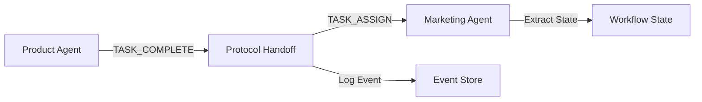

# Protocol Module

## Overview

This module provides structured inter-agent communication using standardized protocol messages. It enables agents to communicate in a formal, validated way, supporting future message broker integration and peer context retrieval.

## What's in This Directory

- **`messages.py`** - Protocol message definitions (TASK_ASSIGN, TASK_COMPLETE, REQUEST_CONTEXT, PROVIDE_CONTEXT)
- **`validator.py`** - Message validation utilities
- **`handoff.py`** - Protocol-aware handoff utilities for converting between state and messages

## Why This Code Exists

The protocol layer addresses several critical needs:

- **Structured Communication**: Standardized message format ensures consistent inter-agent communication
- **Validation**: Message validation prevents invalid data from propagating through the system
- **Future-Proofing**: Enables integration with message brokers (Kafka, RabbitMQ) in Phase 2 Week 6
- **Peer Context**: Supports peer context retrieval (Phase 2 Week 7) for enhanced reconstruction
- **Audit Trail**: Protocol messages are logged with metadata for debugging and compliance

## When It's Used

### Current Usage (Phase 2 Weeks 5-7)

- **Vendor Workflow**: Product → Marketing handoff uses protocol messages
- **Event Logging**: Protocol messages are logged with metadata in event store
- **State Extraction**: Messages are converted to/from agent state for workflow execution
- **Kafka Messaging**: REQUEST_CONTEXT and PROVIDE_CONTEXT messages sent via Kafka
- **Peer Context Retrieval**: Reconstruction module uses protocol messages to query peer agents

### Completed Integration

- **Phase 2 Week 5**: Protocol schema definition and validation ✅
- **Phase 2 Week 6**: Kafka message broker integration ✅
- **Phase 2 Week 7**: Peer context retrieval via Kafka ✅

### Future Usage

- **Phase 3**: Failure injection testing will validate protocol message handling
- **Phase 4**: Semantic handshake protocol will extend message types

## Key Components

### Message Types

#### TASK_ASSIGN

Assigns a task to an agent:

```python
from src.protocol.messages import TaskAssignMessage

message = TaskAssignMessage(
    sender="product-agent-1",
    receiver="marketing-agent-1",
    payload={
        "state": {...},  # Full agent state
        "task_description": "Generate marketing copy",
        "agent_id": "product-agent-1",
        "thread_id": "thread-123",
        "current_step": 3
    }
)
```

**Use Case**: When one agent needs to delegate work to another agent.

#### TASK_COMPLETE

Reports task completion:

```python
from src.protocol.messages import TaskCompleteMessage

message = TaskCompleteMessage(
    sender="product-agent-1",
    receiver="marketing-agent-1",
    payload={
        "state": {...},  # Final agent state
        "completion_status": "Product uploaded successfully",
        "agent_id": "product-agent-1",
        "thread_id": "thread-123",
        "current_step": 3,
        "final_status": "completed"
    }
)
```

**Use Case**: When an agent completes its task and needs to notify others.

#### REQUEST_CONTEXT

Requests context from peer agents about a failed agent. Used during reconstruction to gather distributed context via Kafka:

```python
from src.protocol.messages import RequestContextMessage

# Using the factory method (recommended)
message = RequestContextMessage.create(
    requester_id="reconstructor-123",
    failed_agent_id="product-agent-1",
    thread_id="thread-456",
    time_window_seconds=3600,
    response_topic="agent.context.response.reconstructor-123",
    last_known_step="generate_listing",
    last_known_status="in_progress",
)

# Or manual construction
message = RequestContextMessage(
    sender="reconstruction-module",
    receiver="broadcast",  # Broadcast to all agents
    payload={
        "failed_agent_id": "product-agent-1",
        "thread_id": "thread-456",
        "requester_id": "reconstructor-123",
        "time_window_seconds": 3600,
        "response_topic": "agent.context.response.reconstructor-123",
        "failure_timestamp": "2024-01-15T10:30:00Z",
        "last_known_step": "generate_listing",
        "last_known_status": "in_progress",
    }
)
```

**Payload Schema** (`RequestContextPayload`):
- `failed_agent_id` (required): ID of the agent that failed
- `thread_id` (required): Thread/workflow ID
- `requester_id` (required): ID of the reconstruction module
- `time_window_seconds` (default: 3600): How far back to look for interactions
- `response_topic` (optional): Kafka topic for responses
- `failure_timestamp` (optional): When the failure was detected
- `last_known_step` (optional): Last known step of the failed agent
- `last_known_status` (optional): Last known status

**Use Case**: During reconstruction, broadcast to peer agents via Kafka to gather context about failed agent.

#### PROVIDE_CONTEXT

Provides context to reconstruction module in response to REQUEST_CONTEXT:

```python
from src.protocol.messages import ProvideContextMessage

# Using the factory method (recommended)
message = ProvideContextMessage.create(
    responder_id="marketing-agent-1",
    requester_id="reconstructor-123",
    failed_agent_id="product-agent-1",
    thread_id="thread-456",
    interactions=[
        {"event_type": "protocol_handoff", "step_name": "product_to_marketing", ...}
    ],
    memory_state={
        "has_interactions": True,
        "interaction_count": 5,
        "last_interaction_type": "protocol_handoff",
    },
)

# Access helper methods
interactions = message.get_interactions()
memory_state = message.get_memory_state()
```

**Payload Schema** (`ProvideContextPayload`):
- `responder_id` (required): ID of the agent providing context
- `failed_agent_id` (required): ID of the failed agent
- `thread_id` (required): Thread/workflow ID
- `interactions` (default: []): List of interaction events with the failed agent
- `memory_state` (default: {}): Relevant memory/state from responder's perspective
- `response_timestamp` (auto): When context was collected
- `query_window_seconds` (optional): Time window that was queried

**Use Case**: Peer agents respond to REQUEST_CONTEXT with their interaction history and memory state.

### Message Validation

#### Basic Validation

```python
from src.protocol.validator import validate_message, MessageValidationError

message_data = {
    "message_type": "TASK_ASSIGN",
    "sender": "agent-1",
    "receiver": "agent-2",
    "payload": {"task": "test"}
}

try:
    message = validate_message(message_data)
    print(f"Valid message: {message.message_id}")
except MessageValidationError as e:
    print(f"Validation failed: {e}")
```

#### Structure Validation

```python
from src.protocol.validator import validate_message_structure

# Validate message object structure
is_valid = validate_message_structure(message)
```

#### Safe Validation

```python
from src.protocol.validator import safe_validate_message

# Returns None on error instead of raising
message = safe_validate_message(message_data)
if message is None:
    print("Invalid message")
```

### Handoff Utilities

#### Creating Messages from State

```python
from src.protocol.handoff import create_task_assign_message, create_task_complete_message
from src.agents.base import AgentState

state: AgentState = {
    "task_id": "task-123",
    "agent_id": "product-agent-1",
    "thread_id": "thread-123",
    "current_step": 3,
    "status": "completed",
    # ... other fields
}

# Create TASK_ASSIGN message
task_assign = create_task_assign_message(
    sender="product-agent-1",
    receiver="marketing-agent-1",
    state=state,
    task_description="Generate marketing copy"
)

# Create TASK_COMPLETE message
task_complete = create_task_complete_message(
    sender="product-agent-1",
    receiver="marketing-agent-1",
    state=state,
    completion_status="Product uploaded successfully"
)
```

#### Extracting State from Messages

```python
from src.protocol.handoff import extract_state_from_message, message_to_state_dict

# Extract state from message
state = extract_state_from_message(task_assign_message)

# Convert message to state dict (includes protocol metadata)
state_dict = message_to_state_dict(task_assign_message)
# state_dict includes: _protocol_message_id, _protocol_message_type, etc.
```

## Usage Examples

### Protocol Handoff in Workflow

```python
from src.protocol.handoff import (
    create_task_complete_message,
    create_task_assign_message,
    message_to_state_dict,
)
from src.protocol.validator import validate_message_structure

def protocol_handoff_product_to_marketing(state: AgentState, config=None) -> AgentState:
    """Protocol-aware handoff: Product → Marketing."""
    
    # Create TASK_COMPLETE message
    task_complete_msg = create_task_complete_message(
        sender="product-agent-1",
        receiver="marketing-agent-1",
        state=state,
        completion_status="Product upload completed"
    )
    
    # Validate message
    validate_message_structure(task_complete_msg)
    
    # Create TASK_ASSIGN message
    task_assign_msg = create_task_assign_message(
        sender="product-agent-1",
        receiver="marketing-agent-1",
        state=state,
        task_description="Generate marketing copy"
    )
    
    # Extract state for Marketing agent
    marketing_state = message_to_state_dict(task_assign_msg)
    marketing_state["agent_id"] = "marketing-agent-1"
    
    return marketing_state
```

### Validating Incoming Messages

```python
from src.protocol.validator import validate_message, MessageValidationError

def handle_incoming_message(message_data: dict):
    """Handle and validate incoming protocol message."""
    try:
        message = validate_message(message_data)
        
        # Process based on message type
        if message.message_type == "TASK_ASSIGN":
            state = extract_state_from_message(message)
            # Process task assignment
        elif message.message_type == "TASK_COMPLETE":
            # Process completion notification
            pass
            
    except MessageValidationError as e:
        # Log invalid message
        print(f"Invalid message received: {e}")
        return None
```

### Protocol Message Logging

```python
from src.persistence.event_store import event_store
from src.protocol.messages import TaskAssignMessage

# Log protocol message with metadata
event_store.log_event(
    agent_id="product-agent-1",
    thread_id="thread-123",
    event_type="protocol_handoff",
    step_name="product_to_marketing",
    input_data={"task_complete_message_id": task_complete_msg.message_id},
    output_data={"task_assign_message_id": task_assign_msg.message_id},
    protocol_message=task_complete_msg,  # Protocol message metadata added automatically
)
```

## Architecture/Design Decisions

### Pydantic Models

**Why Pydantic?**

- **Type Safety**: Automatic validation of message structure
- **Serialization**: Built-in JSON serialization support
- **Documentation**: Field descriptions serve as inline documentation
- **Error Messages**: Clear validation error messages

### Message Type Literals

**Why Literal types?**

- **Type Safety**: Prevents invalid message types at type-checking time
- **IDE Support**: Autocomplete for valid message types
- **Runtime Validation**: Pydantic validates against literal values

### Separate Handoff Module

**Why separate from messages.py?**

- **Separation of Concerns**: Message definitions vs. conversion logic
- **Reusability**: Handoff utilities can be used independently
- **Testability**: Easier to test conversion logic separately

### Protocol Metadata in State

**Why add `_protocol_*` fields to state?**

- **Traceability**: Track which protocol message created the state
- **Debugging**: Easier to trace state back to originating message
- **Future Use**: May be needed for message broker integration

## Protocol Handoff Flow



1. **Product Agent** completes its task
2. **Protocol Handoff** creates TASK_COMPLETE and TASK_ASSIGN messages
3. **Messages are validated** for structure correctness
4. **Event Store** logs protocol handoff with message metadata
5. **Marketing Agent** receives TASK_ASSIGN message
6. **State is extracted** from message for workflow execution

## Related Modules

- **[`src/workflows/`](../workflows/README.md)** - Workflows use protocol handoff for inter-agent communication
- **[`src/persistence/event_store.py`](../persistence/event_store.py)** - Logs protocol messages with metadata
- **[`src/agents/`](../agents/README.md)** - Agents receive protocol messages and extract state
- **[`src/reconstruction/`](../reconstruction/README.md)** - Uses REQUEST_CONTEXT/PROVIDE_CONTEXT for peer context retrieval
- **[`src/messaging/`](../messaging/README.md)** - Kafka infrastructure for sending/receiving protocol messages

