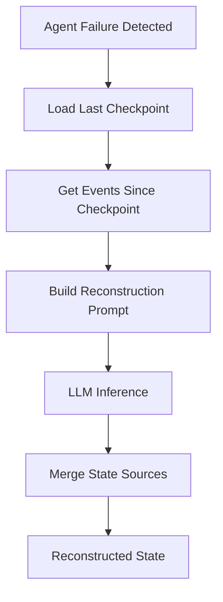
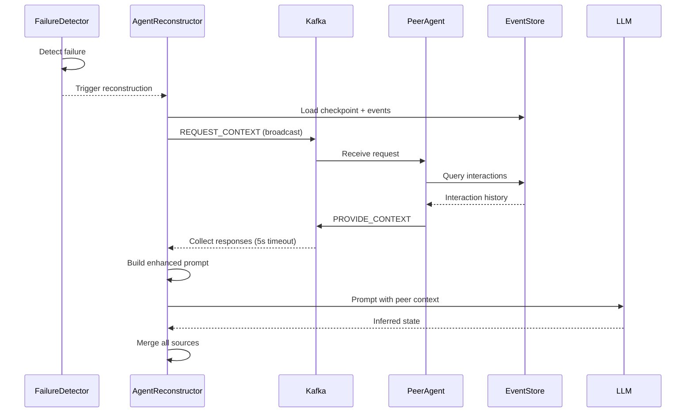
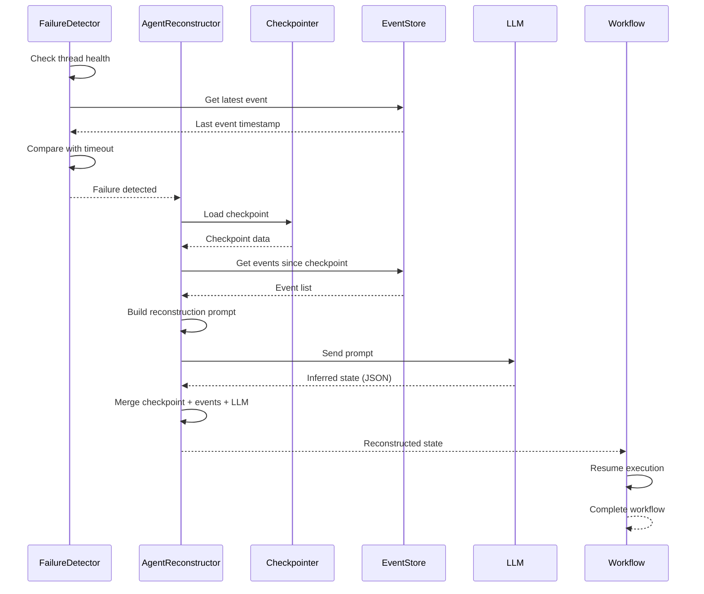

# Reconstruction Module

## Overview

This module provides failure detection and agent state reconstruction capabilities. It enables the system to detect when agents fail and reconstruct their state from checkpoints and event logs, allowing workflows to recover and resume execution.

## What's in This Directory

- **`detector.py`** - Failure detection based on timeout and inactivity
- **`reconstructor.py`** - Agent state reconstruction using checkpoints, events, and LLM inference
- **`demo.py`** - Demonstration script for end-to-end reconstruction process

## Why This Code Exists

The reconstruction module addresses critical resilience requirements:

- **Failure Detection**: Automatically detects when agents fail or become unresponsive
- **State Recovery**: Reconstructs agent state after failure using available data sources
- **Workflow Continuity**: Enables workflows to resume from failure points instead of restarting
- **MTTR-A Reduction**: Minimizes Mean Time to Recovery - Agentic by automating recovery

## When It's Used

### Failure Detection

- **Health Checks**: Periodically checks agent and thread health
- **Timeout Detection**: Identifies agents that haven't produced events within timeout window
- **Failure Monitoring**: Scans for failed agents and threads across the system

### State Reconstruction

- **After Failure**: Reconstructs state when an agent fails during workflow execution
- **Recovery Workflows**: Used by recovery helper functions to resume failed workflows
- **Testing**: Used in reconstruction tests to validate recovery mechanisms

### Recovery Helpers

- **Automatic Recovery**: `recover_and_resume_workflow()` provides end-to-end recovery
- **Manual Recovery**: `AgentReconstructor` can be used directly for custom recovery logic

## Key Components

### Failure Detection

#### FailureDetector Class

Detects agent failures based on timeout and event inactivity:

```python
from src.reconstruction.detector import FailureDetector

detector = FailureDetector(timeout_seconds=30)

# Check if agent is healthy
is_healthy = detector.check_agent_health("product-agent-1")

# Check if thread/workflow is healthy
is_healthy = detector.check_thread_health("thread-123")

# Get list of failed agents
failed_agents = detector.get_failed_agents()

# Get list of failed threads
failed_threads = detector.get_failed_threads()
```

**Detection Logic:**

1. Queries event store for latest event for agent/thread
2. Calculates time since last event
3. Compares against timeout threshold
4. Checks if last event indicates incomplete workflow

### State Reconstruction

#### AgentReconstructor Class

Reconstructs agent state from multiple data sources:

```python
from src.reconstruction.reconstructor import AgentReconstructor

reconstructor = AgentReconstructor(
    checkpointer=None,  # Uses default checkpointer
    llm_model=None      # Uses default LLM model
)

# Reconstruct state for failed agent
reconstruction_result = reconstructor.reconstruct(
    agent_id="product-agent-1",
    thread_id="thread-123"
)
```

**Reconstruction Process:**



1. **Load Checkpoint**: Retrieves last saved checkpoint from LangGraph checkpointer
2. **Get Events**: Queries event store for events since checkpoint timestamp
3. **Build Prompt**: Constructs LLM prompt with checkpoint data and event history
4. **LLM Inference**: Uses LLM to infer missing state and next actions
5. **Merge State**: Combines checkpoint, events, and LLM inference into final state

#### Reconstruction Prompt

The reconstructor builds a detailed prompt for the LLM:

```python
prompt = f"""
You are reconstructing the state of a failed agent.

Checkpoint Data:
{json.dumps(checkpoint_data, indent=2)}

Event History:
{formatted_events}

Based on this information, infer:
1. Current step the agent was on
2. Status of the workflow
3. Any missing data that needs to be recovered
4. Next action the agent should take

Return JSON with: current_step, status, missing_data, next_action
"""
```

**Prompt Components:**

- **Checkpoint Data**: Last known state from LangGraph checkpoint
- **Event History**: Chronological list of events since checkpoint
- **Context**: Agent ID, thread ID, and failure information

### Recovery Helper Functions

#### recover_and_resume_workflow()

Complete recovery workflow that detects failure, reconstructs state, and resumes execution:

```python
from src.reconstruction.reconstructor import recover_and_resume_workflow
from src.workflows.product_workflow import create_product_upload_workflow

workflow = create_product_upload_workflow()

result = recover_and_resume_workflow(
    workflow=workflow,
    agent_id="product-agent-1",
    thread_id="thread-123",
    initial_state={
        "task_id": "task-123",
        "agent_id": "product-agent-1",
        # ... other initial state fields
    },
    timeout_seconds=30
)

if result["recovered"]:
    print("Workflow was recovered and completed!")
    print(f"Final result: {result['final_result']}")
else:
    print("No recovery needed or recovery failed")
```

**Recovery Flow:**

1. **Failure Detection**: Checks if thread has failed using `FailureDetector`
2. **State Reconstruction**: Reconstructs state using `AgentReconstructor`
3. **State Merging**: Merges reconstructed state with initial state
4. **Workflow Resume**: Invokes workflow with reconstructed state
5. **Result Return**: Returns recovery status and final workflow result

### Async Recovery with Peer Context

#### reconstruct_async()

Asynchronous reconstruction that queries peer agents via Kafka for enhanced context:

```python
from src.reconstruction.reconstructor import AgentReconstructor

reconstructor = AgentReconstructor(
    enable_peer_context=True,
    peer_context_timeout=5.0,
)

result = await reconstructor.reconstruct_async(
    agent_id="product-agent-1",
    thread_id="thread-123",
)

# Result includes peer context
print(f"Peer agents queried: {result['peer_agents_queried']}")
print(f"Peer context: {result['peer_context']}")
print(f"Peer insights: {result['reconstructed_state'].get('peer_insights')}")
```

**Reconstruction with Peer Context Flow:**

1. **Load Checkpoint**: Retrieves last saved checkpoint
2. **Get Events**: Queries event store for events since checkpoint
3. **Query Peers**: Broadcasts REQUEST_CONTEXT via Kafka to peer agents
4. **Collect Responses**: Gathers PROVIDE_CONTEXT responses within timeout
5. **Build Enhanced Prompt**: Constructs LLM prompt with checkpoint, events, AND peer context
6. **LLM Inference**: Uses LLM to infer missing state with additional peer insights
7. **Merge State**: Combines all sources including peer context into final state

#### recover_and_resume_workflow_async()

Complete async recovery workflow with peer context retrieval:

```python
from src.reconstruction.reconstructor import recover_and_resume_workflow_async

result = await recover_and_resume_workflow_async(
    workflow=workflow,
    agent_id="product-agent-1",
    thread_id="thread-123",
    initial_state=initial_state,
    use_peer_context=True,
    peer_context_timeout=5.0,
)

if result["recovered"]:
    print(f"Workflow recovered!")
    print(f"Peer context used: {result['peer_context_used']}")
    print(f"Final status: {result['final_result']['status']}")
```

### Peer Context Retrieval Flow



## Usage Examples

### Basic Failure Detection

```python
from src.reconstruction.detector import FailureDetector

detector = FailureDetector(timeout_seconds=60)

# Check specific agent
if not detector.check_agent_health("product-agent-1"):
    print("Agent has failed!")

# Get all failed agents
failed = detector.get_failed_agents()
for agent_id in failed:
    print(f"Failed agent: {agent_id}")
```

### Manual State Reconstruction

```python
from src.reconstruction.reconstructor import AgentReconstructor

reconstructor = AgentReconstructor()

try:
    result = reconstructor.reconstruct(
        agent_id="product-agent-1",
        thread_id="thread-123"
    )
    
    reconstructed_state = result["reconstructed_state"]
    print(f"Reconstructed step: {reconstructed_state['current_step']}")
    print(f"Reconstructed status: {reconstructed_state['status']}")
    
except ValueError as e:
    print(f"Reconstruction failed: {e}")
```

### Complete Recovery Workflow

```python
from src.reconstruction.reconstructor import recover_and_resume_workflow
from src.workflows.vendor_workflow import create_vendor_workflow
from src.agents.base import AgentState

workflow = create_vendor_workflow()

initial_state: AgentState = {
    "task_id": "task-123",
    "agent_id": "product-agent-1",
    "thread_id": "failed-thread-123",
    "current_step": 0,
    "status": "pending",
    "messages": [],
    "product_data": {...},
    "generated_listing": None,
    "error": None,
    "metadata": {},
}

# Attempt recovery
result = recover_and_resume_workflow(
    workflow=workflow,
    agent_id="product-agent-1",
    thread_id="failed-thread-123",
    initial_state=initial_state,
    timeout_seconds=30
)

# Check result
if result["recovered"]:
    print("✓ Recovery successful!")
    print(f"Final status: {result['final_result']['status']}")
else:
    if result.get("error"):
        print(f"✗ Recovery failed: {result['error']}")
    else:
        print("ℹ No recovery needed")
```

### Custom Reconstruction with LLM Override

```python
from src.reconstruction.reconstructor import AgentReconstructor

# Use specific LLM model for reconstruction
reconstructor = AgentReconstructor(
    llm_model="gpt-4o",  # Use more capable model for reconstruction
)

result = reconstructor.reconstruct(
    agent_id="product-agent-1",
    thread_id="thread-123"
)
```

## Architecture/Design Decisions

### Multi-Source State Reconstruction

**Why combine checkpoint + events + LLM?**

- **Checkpoint**: Provides last known good state (most reliable)
- **Events**: Provides execution history and context (what happened)
- **LLM**: Infers missing data and next actions (intelligent recovery)

### LLM-Based Inference

**Why use LLM for reconstruction?**

- **Flexibility**: Can handle various failure scenarios and state structures
- **Context Understanding**: Understands event sequences and workflow patterns
- **Missing Data Inference**: Can infer missing state fields from context
- **Future-Proof**: Can be enhanced with more sophisticated prompts

### Timeout-Based Detection

**Why timeout instead of explicit failure signals?**

- **Robustness**: Works even if agent crashes without signaling failure
- **Simplicity**: No need for explicit failure reporting mechanisms
- **Configurable**: Timeout can be adjusted based on workflow characteristics

### State Merging Strategy

**Why merge reconstructed state with initial state?**

- **Completeness**: Ensures all required fields are present
- **Safety**: Initial state provides fallback values
- **Compatibility**: Maintains compatibility with workflow expectations

## Reconstruction Process Flow



## Related Modules

- **[`src/persistence/`](../persistence/README.md)** - Provides checkpointer and event store for reconstruction data sources
- **[`src/workflows/`](../workflows/README.md)** - Workflows are resumed using reconstructed state
- **[`src/agents/`](../agents/README.md)** - Agent state is reconstructed and used to resume agent execution
- **[`src/llm/`](../llm/README.md)** - LLM is used for intelligent state inference
- **[`src/protocol/`](../protocol/README.md)** - Defines REQUEST_CONTEXT and PROVIDE_CONTEXT message schemas
- **[`src/messaging/`](../messaging/README.md)** - Kafka infrastructure for peer context retrieval

