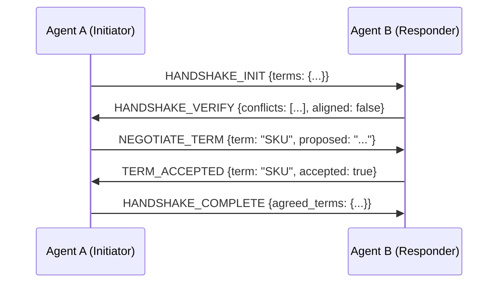
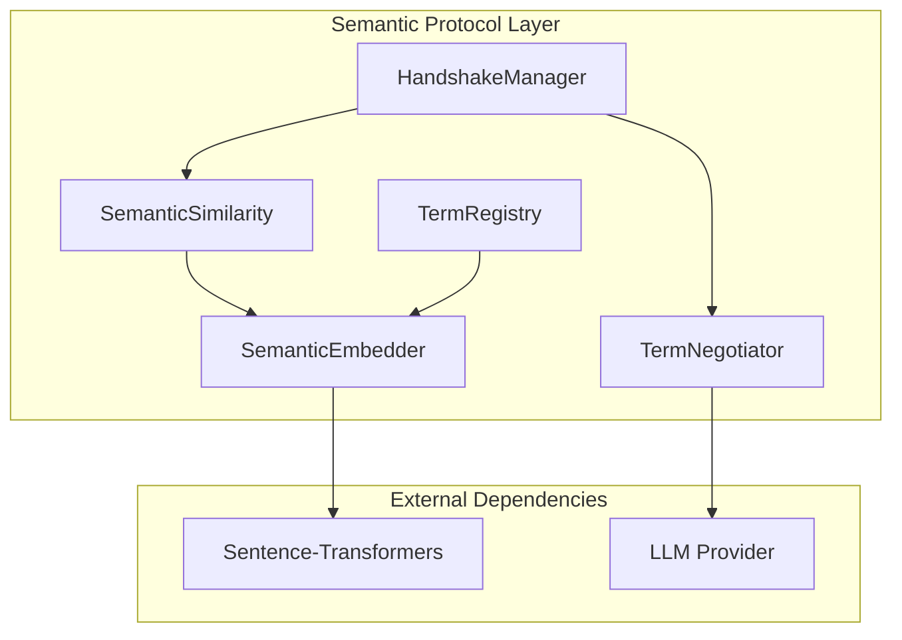

# Semantic Protocol Module

## Overview

This module implements semantic protocol capabilities for inter-agent communication, including embedding-based term alignment checking and a 5-step semantic handshake protocol for term negotiation.

## What's in This Directory

- **`embedder.py`** - Sentence-Transformers wrapper for generating semantic embeddings
- **`similarity.py`** - Cosine similarity computation and alignment checking
- **`terms.py`** - Term registry and extraction utilities
- **`handshake.py`** - 5-step semantic handshake protocol state machine
- **`negotiator.py`** - LLM-based term negotiation for conflict resolution

## Why This Code Exists

The semantic protocol addresses a key challenge in multi-agent systems: **semantic misalignment**. Different agents may use the same terms with different meanings, leading to errors in task handoffs.

**Thesis Contribution**: This module provides a novel semantic handshake protocol that:
1. Detects semantic conflicts before task execution
2. Negotiates unified term definitions using LLM
3. Ensures all agents share a common vocabulary

## Key Components

### Semantic Embedder

Generates vector embeddings for terms using Sentence-Transformers:

```python
from src.semantic.embedder import SemanticEmbedder, get_embedder

embedder = get_embedder()

# Embed single term
embedding = embedder.embed("product")  # Shape: (384,)

# Embed multiple terms
embeddings = embedder.embed(["product", "SKU", "listing"])  # Shape: (3, 384)
```

### Semantic Similarity

Checks alignment between term sets:

```python
from src.semantic.similarity import check_term_alignment, SemanticSimilarity

# Quick check
result = check_term_alignment(
    terms_a=["product", "SKU", "listing"],
    terms_b=["item", "stock_id", "page"],
    threshold=0.85
)

print(f"Aligned: {result.aligned}")
print(f"Conflicts: {result.conflicts}")
print(f"Similarities: {result.similarity_scores}")
```

### Term Registry

Manages domain terms with definitions:

```python
from src.semantic.terms import TermRegistry, get_term_registry

# Create registry with e-commerce defaults
registry = TermRegistry(agent_id="product-agent", load_defaults=True)

# Register custom term
registry.register_term(
    name="bundle",
    definition="A collection of related products sold together",
)

# Export/import terms
terms_data = registry.export_terms()
```

### 5-Step Semantic Handshake

Protocol for establishing term alignment between agents:

```python
from src.semantic.handshake import HandshakeManager

manager = HandshakeManager()

# Run complete handshake
result = await manager.run_handshake(
    initiator="product-agent",
    responder="marketing-agent",
    initiator_terms=product_registry,
    responder_terms=marketing_registry,
)

print(f"Success: {result.success}")
print(f"Agreed terms: {result.agreed_terms}")
print(f"Conflicts resolved: {result.conflicts_resolved}")
```

**Protocol Steps:**



### Term Negotiator

LLM-based negotiation for conflicting terms:

```python
from src.semantic.negotiator import TermNegotiator

negotiator = TermNegotiator()

result = await negotiator.negotiate_term(
    term="SKU",
    definition_a="Stock Keeping Unit - internal ID",
    definition_b="Product variant identifier",
    context_a="Inventory management",
    context_b="E-commerce frontend",
)

print(f"Agreed definition: {result.agreed_definition}")
```

## Usage Examples

### Complete Semantic Handshake Flow

```python
import asyncio
from src.semantic.terms import TermRegistry
from src.semantic.handshake import HandshakeManager
from src.semantic.negotiator import TermNegotiator

async def establish_semantic_alignment():
    # Create term registries for both agents
    product_terms = TermRegistry(agent_id="product-agent")
    product_terms.register_term("SKU", "Stock Keeping Unit for inventory")
    
    marketing_terms = TermRegistry(agent_id="marketing-agent")
    marketing_terms.register_term("SKU", "Product variant for display")
    
    # Create manager with LLM negotiator
    negotiator = TermNegotiator()
    manager = HandshakeManager(negotiator=negotiator)
    
    # Run handshake
    result = await manager.run_handshake(
        initiator="product-agent",
        responder="marketing-agent",
        initiator_terms=product_terms,
        responder_terms=marketing_terms,
    )
    
    if result.success:
        print("Semantic alignment established!")
        print(f"Agreed on {result.total_terms} terms")
        print(f"Resolved {result.conflicts_resolved} conflicts")
        print(f"Handshake took {result.duration_ms:.2f}ms")
    
    return result

# Run
result = asyncio.run(establish_semantic_alignment())
```

### Quick Alignment Check

```python
from src.semantic.similarity import check_term_alignment

# Check if agents share common understanding
result = check_term_alignment(
    terms_a=["product", "listing", "inventory"],
    terms_b=["item", "page", "stock"],
    threshold=0.8
)

if not result.aligned:
    print(f"Warning: Semantic conflicts detected!")
    print(f"Conflicting terms: {result.conflicts}")
    # Trigger handshake protocol...
```

## Architecture



## Configuration

### Default Settings

| Setting | Default | Description |
|---------|---------|-------------|
| Model | `all-MiniLM-L6-v2` | Sentence-Transformers model |
| Similarity Threshold | `0.85` | Minimum similarity for alignment |
| Cache Embeddings | `true` | Cache embeddings for performance |

### Environment Variables

```bash
# Use different embedding model
SEMANTIC_MODEL_NAME=all-mpnet-base-v2
```

## Dependencies

```toml
[tool.poetry.dependencies]
sentence-transformers = "^2.3"
numpy = "^1.24"
```

## Testing

Run semantic module tests:

```bash
pytest tests/test_semantic.py -v
```

## Related Modules

- **[`src/protocol/semantic_messages.py`](../protocol/semantic_messages.py)** - Pydantic models for handshake messages
- **[`src/reconstruction/`](../reconstruction/README.md)** - Uses semantic alignment in reconstruction
- **[`src/llm/`](../llm/README.md)** - LLM provider for term negotiation

## Success Criteria

| Metric | Target |
|--------|--------|
| Conflict detection accuracy | >90% |
| Handshake completion rate | >95% |
| Handshake overhead | <500ms |

