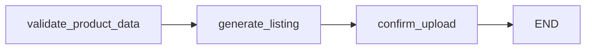
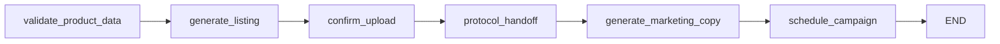
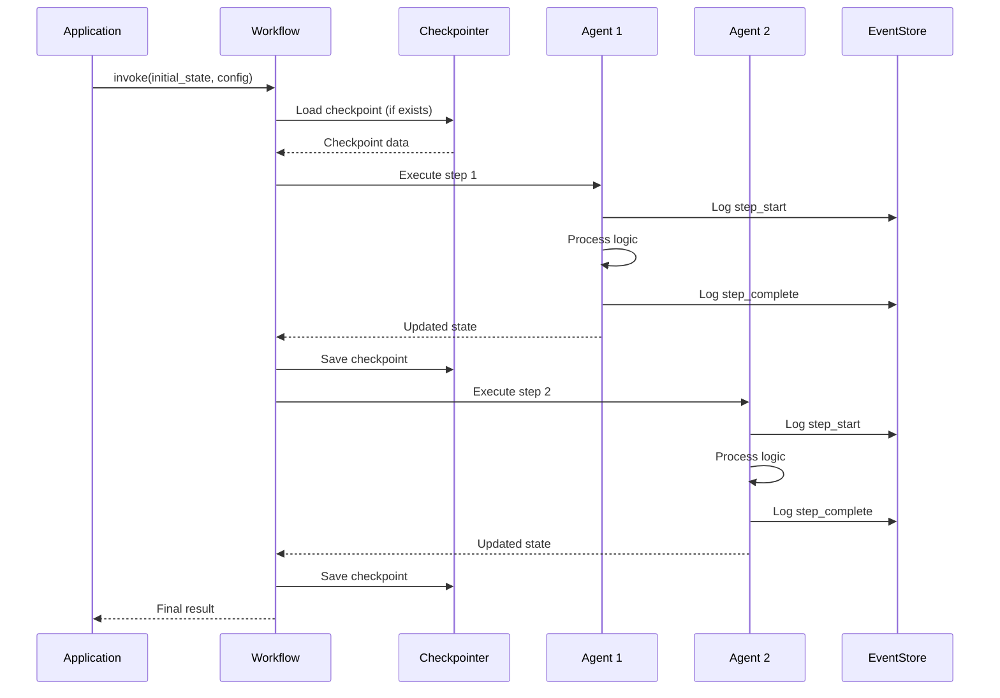

# Workflows Module

## Overview

This module contains LangGraph workflow definitions that orchestrate agent execution. Workflows define the execution flow, state transitions, and enable checkpointing and recovery.

## What's in This Directory

- **`product_workflow.py`** - Product Upload workflow (3-step: validate → generate → confirm)
- **`vendor_workflow.py`** - Vendor workflow combining Product Upload and Marketing agents with protocol handoff

## Why This Code Exists

Workflows provide:

- **Orchestration**: Define the sequence of agent steps and their dependencies
- **State Management**: Maintain workflow state across agent executions
- **Checkpointing**: Enable state persistence for recovery
- **Protocol Integration**: Support structured inter-agent communication
- **Recovery**: Enable workflows to resume from checkpoints after failures

## When It's Used

### Product Upload Workflow

- **Main Entry Point**: Used by `src/main.py` for basic product upload scenarios
- **Testing**: Used in tests for single-agent workflow validation
- **Recovery**: Used by reconstruction module to resume failed product uploads

### Vendor Workflow

- **Multi-Agent Scenarios**: Used for complete vendor onboarding (product + marketing)
- **Protocol Demonstration**: Demonstrates protocol message handoff between agents
- **Integration Testing**: Used in tests for multi-agent workflow validation

## Key Components

### Workflow Structure

All workflows follow this pattern:

```python
from langgraph.graph import StateGraph, END
from src.agents.base import AgentState
from src.persistence.checkpointer import get_checkpointer

def create_workflow(checkpointer=None):
    # 1. Create state graph
    workflow = StateGraph(AgentState)
    
    # 2. Add nodes (agent functions)
    workflow.add_node("step1", agent_function_1)
    workflow.add_node("step2", agent_function_2)
    
    # 3. Define edges (execution flow)
    workflow.set_entry_point("step1")
    workflow.add_edge("step1", "step2")
    workflow.add_edge("step2", END)
    
    # 4. Compile with checkpointer
    if checkpointer is None:
        checkpointer = get_checkpointer()
    
    return workflow.compile(checkpointer=checkpointer)
```

### Product Upload Workflow

Simple 3-step workflow:



**Steps:**

1. **validate_product_data** - Validates product data completeness
2. **generate_listing** - Generates product listing using LLM
3. **confirm_upload** - Confirms upload and updates status

**Usage:**

```python
from src.workflows.product_workflow import create_product_upload_workflow
from src.agents.base import AgentState

workflow = create_product_upload_workflow()

initial_state: AgentState = {
    "task_id": "task-123",
    "agent_id": "product-agent-1",
    "thread_id": "thread-123",
    "current_step": 0,
    "status": "pending",
    "messages": [],
    "product_data": {
        "name": "Wireless Headphones",
        "price": 79.99,
        "category": "Electronics"
    },
    "generated_listing": None,
    "error": None,
    "metadata": {},
}

config = {"configurable": {"thread_id": "thread-123", "checkpoint_ns": ""}}
result = workflow.invoke(initial_state, config)
```

### Vendor Workflow

Multi-agent workflow with protocol handoff:



**Steps:**

1. **Product Upload Steps** (same as Product Upload workflow)
   - validate_product_data
   - generate_listing
   - confirm_upload

2. **Protocol Handoff** - Converts Product completion to Marketing task assignment
   - Creates TASK_COMPLETE message
   - Creates TASK_ASSIGN message
   - Extracts state for Marketing agent
   - Logs protocol handoff events

3. **Marketing Steps**
   - generate_marketing_copy - Generates marketing copy from product listing
   - schedule_campaign - Schedules marketing campaign

**Usage:**

```python
from src.workflows.vendor_workflow import create_vendor_workflow
from src.agents.base import AgentState

workflow = create_vendor_workflow()

initial_state: AgentState = {
    "task_id": "task-123",
    "agent_id": "product-agent-1",
    "thread_id": "thread-123",
    "current_step": 0,
    "status": "pending",
    "messages": [],
    "product_data": {...},
    "generated_listing": None,
    "error": None,
    "metadata": {},
}

config = {"configurable": {"thread_id": "thread-123", "checkpoint_ns": ""}}
result = workflow.invoke(initial_state, config)
```

### Protocol Handoff Node

The vendor workflow includes a protocol handoff node:

```python
@with_logging
def protocol_handoff_product_to_marketing(state: AgentState, config=None) -> AgentState:
    """Protocol-aware handoff: Product → Marketing."""
    
    # Create protocol messages
    task_complete_msg = create_task_complete_message(...)
    task_assign_msg = create_task_assign_message(...)
    
    # Validate messages
    validate_message_structure(task_complete_msg)
    validate_message_structure(task_assign_msg)
    
    # Extract state for Marketing agent
    marketing_state = message_to_state_dict(task_assign_msg)
    marketing_state["agent_id"] = "marketing-agent-1"
    
    # Log protocol handoff
    event_store.log_event(..., protocol_message=task_complete_msg)
    
    return marketing_state
```

## Usage Examples

### Basic Workflow Execution

```python
from src.workflows.product_workflow import create_product_upload_workflow
from src.agents.base import AgentState

# Create workflow
workflow = create_product_upload_workflow()

# Prepare initial state
initial_state: AgentState = {
    "task_id": "task-123",
    "agent_id": "product-agent-1",
    "thread_id": "thread-123",
    "current_step": 0,
    "status": "pending",
    "messages": [],
    "product_data": {
        "name": "Test Product",
        "description": "A test product",
        "price": 99.99,
        "category": "Electronics",
        "sku": "TEST-001"
    },
    "generated_listing": None,
    "error": None,
    "metadata": {},
}

# Configure workflow
config = {
    "configurable": {
        "thread_id": "thread-123",
        "checkpoint_ns": ""
    }
}

# Execute workflow
result = workflow.invoke(initial_state, config)

# Check result
print(f"Status: {result['status']}")
print(f"Final step: {result['current_step']}")
```

### Workflow with Failure Injection

```python
# Inject failure at specific step (for testing)
config = {
    "configurable": {
        "thread_id": "thread-123",
        "checkpoint_ns": "",
        "fail_step": "generate_listing"  # Inject failure here
    }
}

try:
    result = workflow.invoke(initial_state, config)
except RuntimeError as e:
    print(f"Workflow failed as expected: {e}")
    # Now test reconstruction...
```

### Resuming Workflow from Checkpoint

```python
from src.reconstruction.reconstructor import recover_and_resume_workflow

# Workflow automatically resumes from checkpoint if thread_id matches
config = {
    "configurable": {
        "thread_id": "existing-thread-123",  # Same thread_id as before
        "checkpoint_ns": ""
    }
}

# Workflow will resume from last checkpoint
result = workflow.invoke(initial_state, config)
```

### Custom Checkpointer

```python
from src.persistence.checkpointer import get_checkpointer

# Use in-memory checkpointer for testing
checkpointer = get_checkpointer(use_memory=True)
workflow = create_product_upload_workflow(checkpointer=checkpointer)

# Or use persistent checkpointer
checkpointer = get_checkpointer(use_memory=False)
workflow = create_product_upload_workflow(checkpointer=checkpointer)
```

## Architecture/Design Decisions

### LangGraph Framework

**Why LangGraph?**

- **State Management**: Built-in state persistence and checkpointing
- **Recovery Support**: Native support for resuming from checkpoints
- **Agent Orchestration**: Designed for multi-agent workflows
- **Checkpointing**: Automatic checkpoint creation at each step

### StateGraph Pattern

**Why StateGraph?**

- **Type Safety**: TypedDict state provides type checking
- **State Validation**: LangGraph validates state structure
- **Checkpointing**: State automatically checkpointed at each node

### Protocol Handoff Node

**Why separate handoff node?**

- **Separation of Concerns**: Handoff logic separate from agent logic
- **Protocol Logging**: Centralized place to log protocol messages
- **Reusability**: Handoff pattern can be reused for other agent transitions
- **Testability**: Easier to test protocol handoff independently

### Checkpointer Integration

**Why pass checkpointer to workflow?**

- **Flexibility**: Can use different checkpointers (memory, SQLite, PostgreSQL)
- **Testing**: Easy to use in-memory checkpointer for tests
- **Configuration**: Centralized checkpointer creation via factory function

## Workflow Execution Flow



## Related Modules

- **[`src/agents/`](../agents/README.md)** - Workflows orchestrate agent execution
- **[`src/persistence/checkpointer.py`](../persistence/README.md)** - Workflows use checkpointer for state persistence
- **[`src/protocol/`](../protocol/README.md)** - Vendor workflow uses protocol messages for handoff
- **[`src/reconstruction/`](../reconstruction/README.md)** - Workflows are resumed using reconstructed state
- **[`src/main.py`](../main.py)** - Main entry point creates and executes workflows

